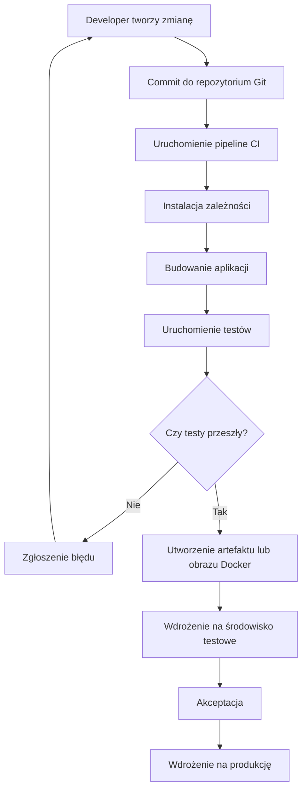

# Zadanie 6: Pierwszy diagram Mermaid

## Prompt

**Stwórz prosty diagram Mermaid przedstawiający przepływ CI/CD.**

## Kod Mermaid

## Opis wygenerowanego diagramu

Diagram przedstawia podstawowy przepływ CI/CD. Proces zaczyna się od utworzenia zmiany przez programistę i wykonania commita do repozytorium Git. Następnie uruchamiany jest pipeline CI, który instaluje zależności, buduje aplikację i uruchamia testy.

Jeśli testy zakończą się niepowodzeniem, błąd wraca do programisty do poprawy. Jeśli testy przejdą poprawnie, tworzony jest artefakt lub obraz Docker, aplikacja trafia na środowisko testowe, a po akceptacji może zostać wdrożona na produkcję.

## Rezultat

Kod Mermaid można wkleić do Mermaid Live Editor, aby zobaczyć graficzny diagram przepływu CI/CD.
